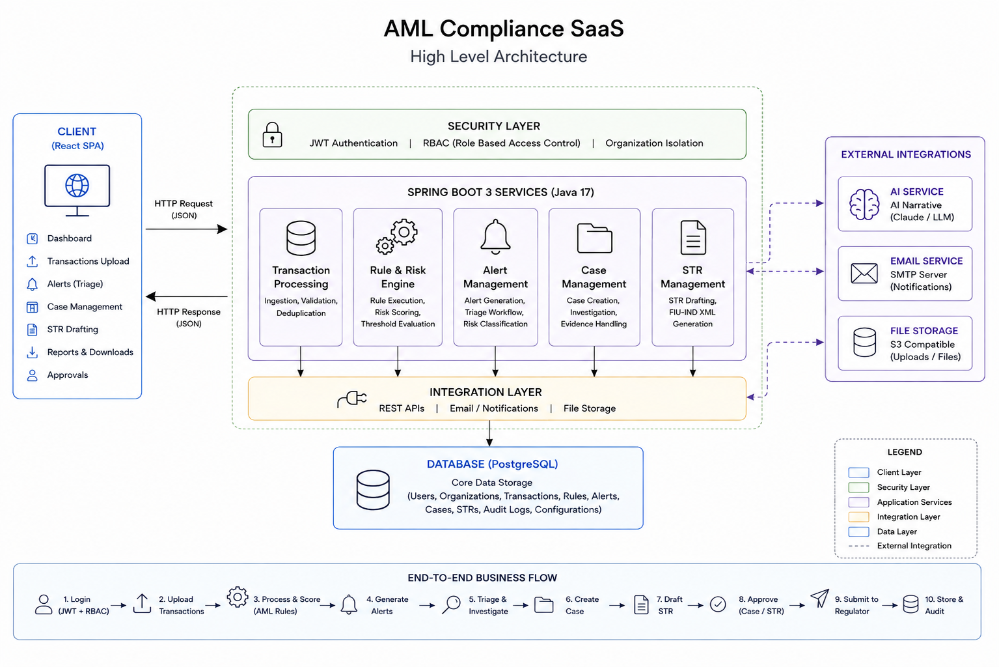

# Complyra — AML Compliance SaaS for Indian Cooperative Banks

> **Anti-Money Laundering monitoring, STR/CTR regulatory filing, and AI-assisted investigation — built specifically for the Indian cooperative banking sector.**

---



---

## What It Does

Complyra automates the AML compliance lifecycle for Indian cooperative banks under applicable PMLA, RBI, and FIU-IND requirements. It replaces manual spreadsheet-based transaction monitoring with configurable compliance rules, structured investigation workflows, and regulatory report generation.

---

## Architecture Overview

The platform is a **5-layer multi-tenant SaaS** deployed as a Spring Boot backend + React SPA:

| Layer | Technology | Responsibility |
|---|---|---|
| **Client** | React 18 · Ant Design · Tailwind · Vite | Compliance modules, reporting UI, role-aware rendering |
| **Security** | Spring Security · JWT · RBAC | Authentication, authorization, tenant-aware access |
| **Services** | Spring Boot 3 · Java 17 | Transaction monitoring, rule engine, alerts, cases, regulatory workflows, AI integration |
| **Data** | PostgreSQL · JPA/Hibernate · Flyway | Transactional data, configuration, reporting, audit data |
| **External** | AI API · CBS · FIU-IND · SMTP | AI generation, banking data integration, regulatory workflows, notifications |

---

## Core Feature Modules

### Transaction Monitoring

- Ingests transaction data through file uploads and banking system integrations
- Supports multiple banking data formats
- Performs field normalisation and transaction deduplication

### AML Rule Engine

- Configurable compliance rules with organisation-specific thresholds
- Supports transaction, customer, velocity, risk, and behavioural monitoring
- Rules can be configured without changing the core application workflow

### Alert Management

- Automatically generates risk alerts from rule violations
- Provides an analyst triage workflow
- Supports assignment, investigation notes, escalation, and case creation

### Case Management

- Groups related alerts and transactions into investigation cases
- Provides transaction and suspicious-activity analysis
- Supports AI-assisted narrative generation
- Allows cases to be escalated into regulatory reporting workflows

### STR Filing (Suspicious Transaction Reports)

- Supports a maker-checker approval workflow
- Separates report preparation from approval responsibilities
- Supports AI-assisted narrative generation
- Generates regulator-compatible XML reports
- Provides controlled access to generated regulatory files

### CTR Filing (Currency Transaction Reports)

- Identifies qualifying cash transaction activity
- Supports duplicate detection and filing workflows
- Uses the same maker-checker model as other regulatory reports
- Provides filing status and deadline monitoring
- Generates regulator-compatible reporting output

### Customer & KYC

- Maintains customer profiles and KYC information
- Supports multiple customer/entity types
- Tracks customer risk and relevant compliance indicators

---

## Multi-Tenancy Design

The platform supports multiple organisations within a shared SaaS architecture with tenant-aware authentication, authorization, and data access controls.

Tenant context is propagated through the request lifecycle to ensure that organisation-level data remains isolated across application operations.

---

## Role-Based Access Control

Three primary roles provide distinct permission boundaries:

| Role | Permissions |
|---|---|
| `SAAS_ADMIN` | Platform administration and organisation management |
| `COMPLIANCE_OFFICER` | Review, approve, reject, and access regulatory workflows |
| `ANALYST` | Transaction analysis, alert triage, investigations, and report preparation |

The regulatory workflow follows a **maker-checker / four-eyes principle**, separating report preparation from approval responsibilities.

---

## Feature Gate System

The platform supports tenant-level feature entitlements for controlling access to optional capabilities.

| Feature | Tier | Description |
|---|---|---|
| `STR_FILING` | Tier 1 | Suspicious Transaction Report filing |
| `CTR_FILING` | Tier 1 | Currency Transaction Report filing |
| `AI_NARRATIVE` | Tier 2 | AI-assisted narrative generation |
| `ADVANCED_ANALYTICS` | Tier 2 | Extended reporting and analytics |
| `API_ACCESS` | Tier 2 | Direct banking system integration |

---

## Regulatory Filing

The platform generates regulator-compatible XML reports from approved compliance workflows.

```text
Investigation
     ↓
Report Preparation
     ↓
Approval
     ↓
Regulatory XML Generation
     ↓
Controlled Export
```

Regulatory files are protected through controlled access and secure storage mechanisms.

---

## Audit Trail

Significant compliance and administrative operations are recorded through an append-only audit mechanism.

The audit trail supports:
- User and organisation traceability
- Compliance workflow tracking
- Report lifecycle tracking
- Investigation activity tracking
- Administrative activity tracking
  
---

## Tech Stack

**Backend**
- Java 17 · Spring Boot 3
- Spring Security (JWT, RBAC, `@PreAuthorize`)
- Spring Data JPA · Hibernate
- PostgreSQL · Flyway migrations
- HikariCP · Jackson · Lombok

**Frontend**
- React 18 · React Router v6
- Ant Design (tables, modals, forms)
- Tailwind CSS (utility styling)
- Axios (HTTP client with JWT interceptors)
- Vite (build tooling)

**AI / External**
- Anthropic Claude API (`claude-sonnet-4-6`) — AI-assisted narrative generation
- SMTP / JavaMailSender — email verification and notifications
- S3-compatible storage — CSV/XLSX upload and file management

---

## API Reference

The application exposes REST APIs for the major compliance workflows, including:

```
# Transactions
POST   /transactions/upload
GET    /transactions

# Alerts
GET    /alerts
PATCH  /alerts/{id}/status

# Cases
POST   /cases
GET    /cases/{id}

# Regulatory Reports
POST   /str-reports
POST   /ctr-reports

# Configuration
GET/PUT /rule-configurations
GET/PUT /organization-config

```

---
