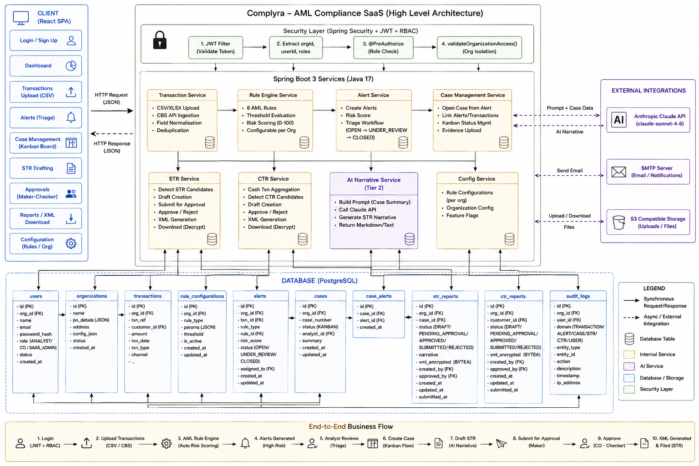

# Complyra — AML Compliance SaaS for Indian Cooperative Banks

> **Anti-Money Laundering monitoring, STR/CTR regulatory filing, and AI-assisted investigation — built specifically for the Indian cooperative banking sector.**

---



---

## What It Does

Complyra automates the AML compliance lifecycle that Indian cooperative banks must follow under PMLA 2002 and RBI/FIU-IND directives. It replaces manual spreadsheet-based transaction monitoring with a configurable rule engine, structured investigation workflows, and one-click FIU-IND regulatory XML filing.

---

## Architecture Overview

The platform is a **5-layer multi-tenant SaaS** deployed as a Spring Boot backend + React SPA:

| Layer | Technology | Responsibility |
|---|---|---|
| **Client** | React 18 · Ant Design · Tailwind · Vite | Module pages, regulatory filing UI, role-aware rendering |
| **Security** | Spring Security · JWT · RBAC | Auth, tenant isolation, feature gates, audit interception |
| **Services** | Spring Boot 3 · Java 17 | Rule engine, alert/case/STR/CTR workflows, AI narrative |
| **Data** | PostgreSQL · JPA/Hibernate · Flyway | Transactional store, encrypted XML, append-only audit log |
| **External** | Anthropic API · CBS · FIU-IND · SMTP | AI generation, bank data ingest, regulatory submission |

---

## Core Feature Modules

### Transaction Monitoring
- Ingests transactions via CSV/Excel upload or direct Core Banking System (CBS) API integration
- Supports Finacle, Flexcube, and other cooperative bank CBS formats
- Automatic field normalisation and deduplication by transaction reference

### AML Rule Engine
- 8 configurable rule types with per-organisation threshold overrides
- **Rules:** Cash Threshold, Cumulative Monthly Volume, Structuring Detection, Round Amount, High-Risk Country, PEP Transactions, Rapid Movement, Velocity Spike
- Default thresholds aligned to RBI norms (e.g. ₹10,00,000 cash threshold)
- Rules stored as typed JSON configs — adjustable per bank without code changes

### Alert Management
- Rule violations automatically generate `AmlAlert` entries with risk scores (0–100)
- Triage queue: `OPEN → UNDER_REVIEW → CLOSED`
- Assign to analysts, add notes, escalate to full investigation case

### Case Management
- `AmlCase` groups multiple alerts and linked transactions
- Cash flow analysis and suspicious indicator extraction via `CaseSummary`
- AI-powered narrative generation (Claude claude-sonnet-4-6) — gated on Tier 2 subscription
- Cases can be escalated directly to STR filing

### STR Filing (Suspicious Transaction Reports)
- Full maker-checker workflow: `DRAFT → PENDING_APPROVAL → APPROVED → SUBMITTED`
- **4-eyes principle:** the analyst who submits cannot self-approve (enforced server-side)
- AI narrative auto-populated from case summary (editable)
- FIU-IND compliant XML generated at approval, AES-256 encrypted at rest
- XML decrypted and streamed only on authorised download

### CTR Filing (Currency Transaction Reports)
- Threshold-based detection: aggregates all cash transactions per customer per day ≥ ₹10,00,000
- Duplicate guard prevents double-filing for the same customer/date
- Same maker-checker workflow as STR
- Filing deadline: 15th of the month following the transaction date
- Late-filing detection with dashboard warnings
- FIU-IND compliant `CASHTRANSACTIONS` XML block output

### Customer & KYC
- Full customer profiles: PAN, DOB, KYC status, occupation codes, address
- Customer types: INDIVIDUAL, CORPORATE, TRUST, PARTNERSHIP
- Risk scoring, PEP/sanction flags, account opening date tracking

---

## Multi-Tenancy Design

Every table row carries `organization_id`. The service layer calls `validateOrganizationAccess(orgId, user.getOrganizationId())` on every mutating operation. There is no row-level security at the database layer — isolation is enforced at the application layer consistently.

```
Request → JWT filter → extract orgId from claims
        → @PreAuthorize role check
        → service.validateOrganizationAccess()
        → all queries: WHERE organization_id = :orgId
```

---

## Role-Based Access Control

Three roles with distinct permission boundaries:

| Role | Permissions |
|---|---|
| `SAAS_ADMIN` | Full access to all modules and all orgs |
| `COMPLIANCE_OFFICER` | Approve/reject STR & CTR, download XML, view all |
| `ANALYST` | Create drafts, submit for approval, triage alerts/cases |

Key constraint: `COMPLIANCE_OFFICER` cannot submit-for-approval (CO = checker only). `ANALYST` cannot approve. This 4-eyes separation is enforced at both the `@PreAuthorize` annotation level and inside service methods.

---

## Feature Gate System

All non-core features are gated by `@RequiresFeature(FeatureCode.XYZ)` at the controller level:

```java
@RequiresFeature(FeatureCode.CTR_FILING)
@RestController
public class CtrReportController { ... }
```

| Feature Code | Tier | Description |
|---|---|---|
| `STR_FILING` | Tier 1 | Suspicious Transaction Report filing |
| `CTR_FILING` | Tier 1 | Currency Transaction Report filing |
| `AI_NARRATIVE` | Tier 2 | AI-generated STR narrative |
| `ADVANCED_ANALYTICS` | Tier 2 | Extended reporting and trend analysis |
| `API_ACCESS` | Tier 2 | Direct API integration with CBS |

---

## Regulatory Filing — XML Structure

Both STR and CTR generate FIU-IND v2 compliant XML with the following structure:

```xml
<FIUBATCH>
  <BATCHHEADER>
    <ORIGCODE>PAN_OF_ENTITY</ORIGCODE>
    <REPCODE>CTR</REPCODE>        <!-- or STR -->
    <BATCHDATE>20260615</BATCHDATE>
  </BATCHHEADER>
  <CTR>
    <REPORTHEADER> ... </REPORTHEADER>
    <PRINCIPALOFFICER> ... </PRINCIPALOFFICER>
    <REPORTINGENTITY> ... </REPORTINGENTITY>
    <CUSTOMER> ... </CUSTOMER>
    <ACCOUNT> ... </ACCOUNT>
    <CASHTRANSACTIONS> ... </CASHTRANSACTIONS>
  </CTR>
</FIUBATCH>
```

XML is generated at the **approval step**, AES-256 encrypted, stored as Base64 in the database, and decrypted only when a Compliance Officer downloads it. First download transitions status `APPROVED → SUBMITTED`.

---

## Audit Trail

Every significant action is recorded in `audit_logs` (append-only):

```
AuditDomain: TRANSACTION | STR | CTR | CASE | ALERT | USER
AuditAction: CREATE | UPDATE | DELETE | SUBMIT_FOR_APPROVAL | APPROVE | REJECT | DOWNLOAD
```

Fields: `orgId`, `userId`, `domain`, `entityType`, `entityId`, `action`, `description`, `timestamp`

---

## Tech Stack

**Backend**
- Java 17 · Spring Boot 3
- Spring Security (JWT, RBAC, `@PreAuthorize`)
- Spring Data JPA · Hibernate
- PostgreSQL · Flyway migrations
- HikariCP · Jackson · Lombok

**Frontend**
- React 18 · React Router v6
- Ant Design (tables, modals, forms)
- Tailwind CSS (utility styling)
- Axios (HTTP client with JWT interceptors)
- Vite (build tooling)

**AI / External**
- Anthropic Claude API (`claude-sonnet-4-6`) — STR narrative generation
- SMTP (JavaMailSender) — email verification and notifications
- S3-compatible storage — CSV/XLSX upload and file management

---

## API Reference (Key Endpoints)

All endpoints are prefixed with `/api/organizations/{orgId}/`.

```
# Transactions
POST   /transactions/upload          Upload CSV/XLSX
GET    /transactions                  Paginated list with filters

# Alerts
GET    /alerts                        Triage queue
PATCH  /alerts/{id}/status            Triage action

# Cases
POST   /cases                         Open case from alert
GET    /cases/{id}                    Case detail with summary
POST   /cases/{id}/generate-narrative Claude AI narrative (Tier 2)

# STR Filing
GET    /str-reports/detect            Surface STR candidates
POST   /str-reports                   Create draft
POST   /str-reports/{id}/submit-for-approval
PATCH  /str-reports/{id}/approve
PATCH  /str-reports/{id}/reject
GET    /str-reports/{id}/download     Stream FIU-IND XML

# CTR Filing
GET    /ctr-reports/detect?fromDate=&toDate=   Scan cash candidates
POST   /ctr-reports                   Create draft
POST   /ctr-reports/{id}/submit-for-approval
PATCH  /ctr-reports/{id}/approve
PATCH  /ctr-reports/{id}/reject
GET    /ctr-reports/{id}/download     Stream FIU-IND XML
GET    /ctr-reports/stats             Dashboard aggregates

# Config
GET/PUT /rule-configurations          Per-org rule thresholds
GET/PUT /organization-config          PO details, branch config
```

---
